# Optimizers

## Code structure

All of our code can be found under the `notebooks` folder in our repository. 

## Commands to Reproduce Experiments

In order to run the notebooks we recommend the usage of Google Colab notebooks. 

## Task

The task that we are studying is using VGGNet to do image classfication. 

## Model Architecture

The model is is modelled after VGGNet and involves 4 convolutional layers and then a linear layer to allow for classifications. 

In these experiments we used a VGG-11 architecture as shown below.

We trained for 20 epochs, measuring validation loss and accuracy across each epoch.

## Datasets

We evaluate our approach on 3 publically avaliable datasets. 

#### CIFAR-10

This dataset contains 60k color images which are uniformly distributed accross 10 classes. The images are of size 4x32x32. 
- Alex Krizhevsky. [Learning Multiple Layers of Features from Tiny Images](https://www.cs.toronto.edu/~kriz/learning-features-2009-TR.pdf), 2009.

#### STL-10

This dataset contains 500 training images as well as one thousand testing images per class. Additionally, the dataset also contains 100k unlabeled images, which do not use for training, thus our model doesn't have state of the art performance.

- Adam Coates, Honglak Lee, Andrew Y. Ng. [An Analysis of Single Layer Networks in Unsupervised Feature Learning AISTATS](https://cs.stanford.edu/~acoates/papers/coatesleeng_aistats_2011.pdf), 2011

#### Caltech-101

This dataset consists of colour images of objects belonging to 101 classes. 
- Fei-Fei, Li, Rob Fergus, and Pietro Perona. "[One-shot learning of object categories.](http://vision.stanford.edu/documents/Fei-FeiFergusPerona2006.pdf)" IEEE transactions on pattern analysis and machine intelligence 28.4 (2006): 594-611.

## Experiments

The topics relating to optimizers address different concerns and the hyperparameters of each approach are vastly different. Therefore, we have experiments for each idea and then some comparisons at the end.

### Stocastic Gradient Descent

The first of our experiments looks at how Stocastic Gradient Descent (SGD) and Second Order Stocastic Gradient Descent (2SGD) are a better alternative to Standard Gradient Descent (GD), especially with the introduction of larger datasets. 

As noted in the paper 2SGD is very computationally costly, because each iteration preforms a computation which involves a large dense matrix. For the experiment we decided to replace 2SGD with Averaged Stochastic Gradient Descent (ASGD), which was used as a less costly alternative to 2SGD.

We trained a VGG-11 style model with GD, SGD, and ASGD across three different datasets. For SGD and ASGD a batch size of 32, was used to speed up training slightly, and a learning rate of .01. The models using GD had a learning rate of .1. Momentum and weight decay were not used in any of the models. The code is located in `notebooks/SGDExperiments.ipynb`.

**STL10**

Each of the models were trained for 20 epochs. GD performed notably worse than both of the versions of SGD, having a very low drop in change in loss and underperforming on the test set with an accuracy of 14.35%. SGD and ASGD preformed similarly with a much more noticable decrease in training loss and higher test accuracies at 28.66% and 27.91% respectively.

**Loss**

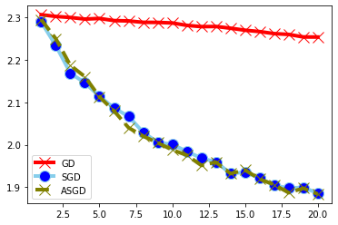 

|   | STL-10 | 
|---|---|
|  GD | 16.08 |
|  SGD | **28.66** |
|  ASGD | 27.91 |

**Caltech101**

Each of the models were trained for 20 epochs. Once again GD performed notably worse than both of the versions of SGD, having a very low drop in change in loss and underperforming on the test set with an accuracy of 11.52%. SGD and ASGD preformed similarly, with ASGD doing slightly better than SGD. SGD had a test accuracy of 20.66% and ASGD has a test accuracy of 21.66%.

**Loss**

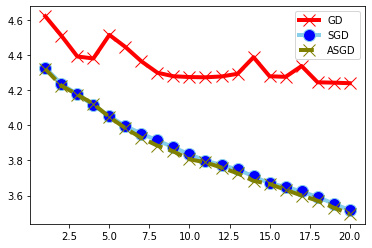 

|   | CalTech101 | 
|---|---|
|  GD | 11.52  | 
|  SGD | 20.66 |
|  ASGD | **21.66**  |

**CIFAR-10**

Each of the models were trained for 10 epochs. Similarly to the other datasets GD was very slow in convergence and preformed poorly on the test set. Additionally, the size of the training set and the use of GD caused the ipykernal to fail due to how memory was required to compute the gradient that we had to split the data between two batches. SGD and ASGD both out performed GD with test accuracies of 72.33 and 72.59 respectively. GD has a test accuracy of 25.67% GD also took on average 3 times as long per epoch as SGD and ASGD.

**Loss**

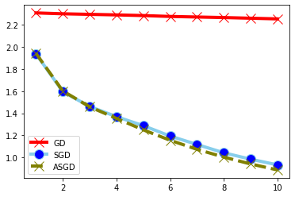 

|   | CIFAR-10 |
|---|---|
|  GD | 25.67 |
|  SGD | 72.33 |
|  ASGD | **72.59** |

**Analysis**

Our team was able to show that with moderately sized or large datasets SGD and ASGD greatly outperformed GD, GD simply uses to much memory, convergest to slowly and has to large of a training time per epoch compared to SGD and ASGD to be used when training on large datasets. This aligns with the papers claims that GD is not a viable optimizer for anything other than very small datasets.

Our results regarding the comparison between SGD and ASGD also align with the paper. Overall, they perform very similarly obtaining test accuracies that are close and having a similar rate of convergence. We also saw that ASGD has a slightly faster rate of conergence and higher accuracy. If we had had the time to conduct further test and train over more epochs we would probably be able to see a greater difference in convergence rate, as was seen in the paper.

Overall, our experiments show that using a Stocastic Gradient Descent based optimizer will lead to faster convergence on larger datasets than a standard Gradient Descent based optimizer.

|   | STL-10 | CalTech101 | CIFAR-10 |
|---|---|---|---|
|  GD | 16.08 | 11.52  |  25.67|
|  SGD | **28.66** | 20.66 |  72.33 |
|  ASGD | 27.91  | **21.66**  |  **72.59** |

### Momentum (CM) and Nesterov's Accelerated Gradient (NAG)

To understand the importance of training with momentum we trained a VGG-11 style model with different momentum coefficients as well as testing Nesterov's Accelerated Gradient across 3 datasets. The code is located in `notebooks/MomentumExperiments.ipynb`.

**CIFAR-10**

Our baseline model without momentum had a performance of 1.3401 loss, 50.67% accuracy while our best performing model using CM reported 0.5305 loss, 83.06% accuracy and the best performing model using NAG reported 0.4804 loss, 84.33% accuracy. 

CM | '
:-|-:
 | 

NAG | '
:-|-:
 | 

CM vs NAG | '
:-|-:
 | 

**STL10**

Our baseline model without momentum had a performance of 2.2834 loss, 13.25% accuracy while our best performing model using CM reported 1.8854 loss, 25.00% accuracy and the best performing model using NAG reported 1.7859 loss, 29.49% accuracy.

CM | '
:-|-:
 | 

NAG | '
:-|-:
 | 

CM vs NAG | '
:-|-:
 | 

**Caltech101**

Our baseline model without momentum had a performance of 4.2107 loss, 12.44% accuracy while our best performing model using CM reported 3.8335 loss, 19.97% accuracy and the best performing model using NAG reported 3.6118 loss, 22.58% accuracy.

CM | '
:-|-:
 | 

NAG | '
:-|-:
 | 

CM vs NAG | '
:-|-:
 | 

**Analysis**

Our testing shows that incorporating momentum has a significant impact on model performance. Both the CM and NAG implementations way outperform the baselines across all datasets. The paper found that loss decreases for higher momentum coefficients, however our results did not show the same relationship. Most datasets had different coefficient values perform best and even had different coefficients perform best when comparing CM to NAG. Despite this discrepancy, our experiments do align with the paper when comparing NAG to CM. NAG performs better with respect to loss and accuracy across all datasets. In general it looks like using NAG momentum seems to be the best momentum strategy to improve model performance.

### Cyclical Learning Rates

To understand the potential impact of Cyclical Learning Rates, we compared Stocastic Gradient Descent (SGD) momentum set to 0.999, which as these performed the best in earlier sections. with and without Cyclical Learning Rates. We compared across multiple datasets. The code for this section is located in `notebooks/cyclicLearningRates.ipynb`. Additionally we compared the different CLR modes (triangular, triangular2, and exp-range. 

**CIFAR**

Triangular | '
:-|-:
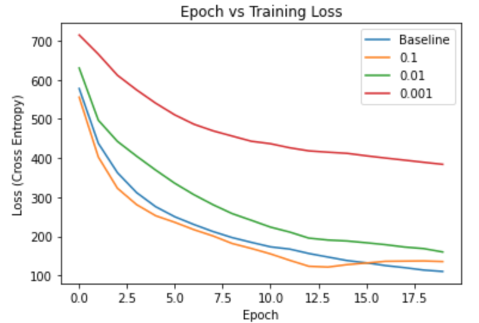 | 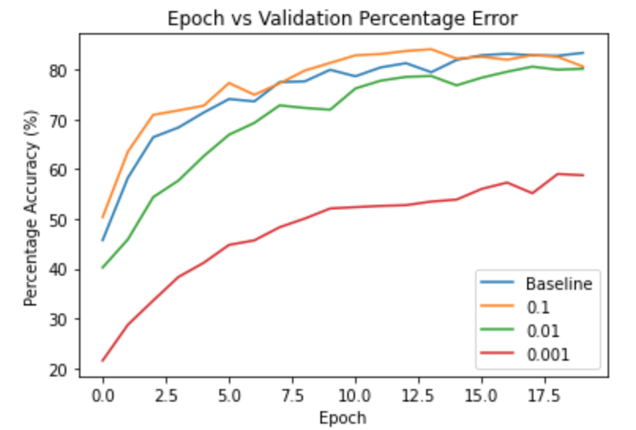

Triangular2 | '
:-|-:
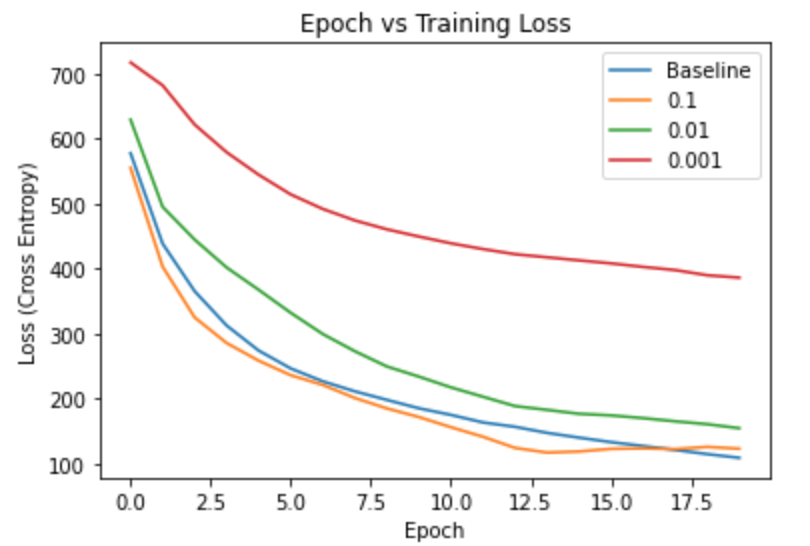 | 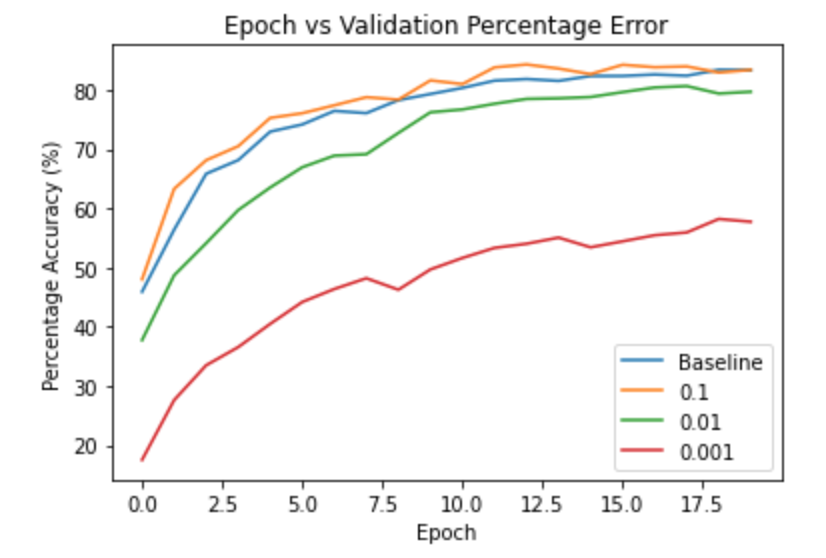

Exp Range | '
:-|-:
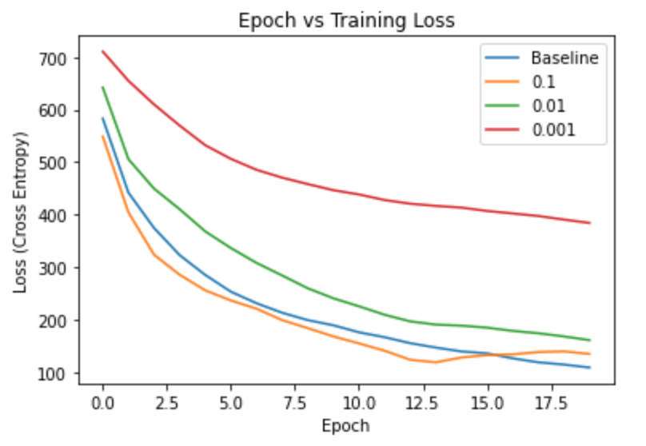 | 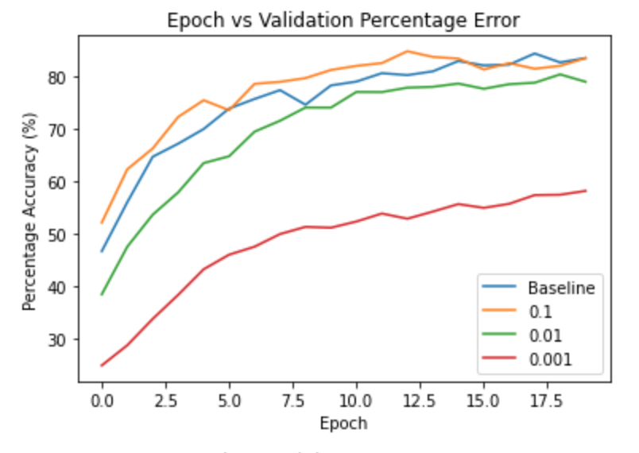

**STL10**

Triangular | '
:-|-:
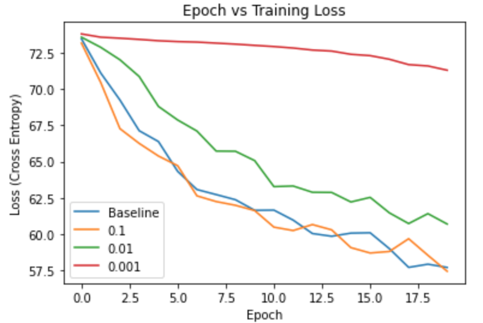 | 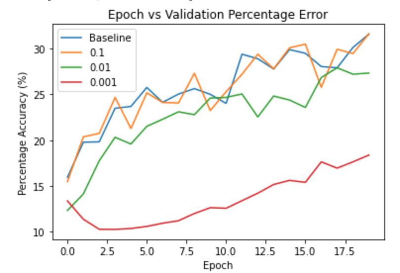

Triangular2 | '
:-|-:
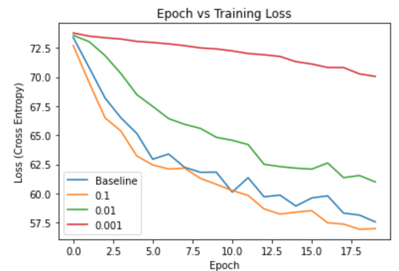 | 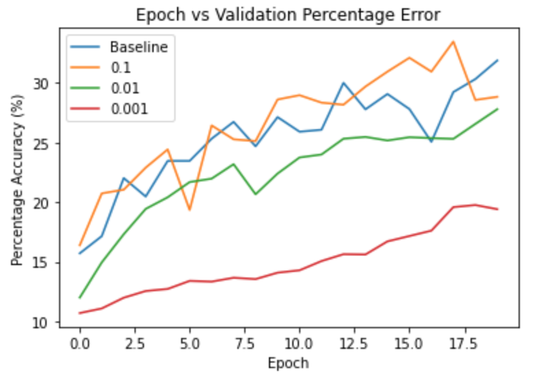

Exp Range | '
:-|-:
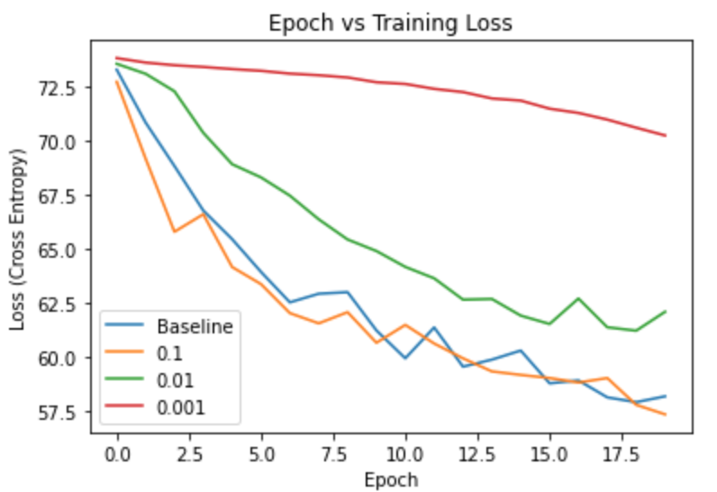 | 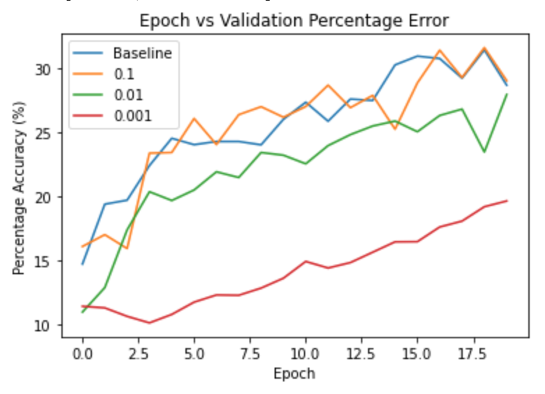

### Stocastic Gradient Descent with Warm Restarts

**SGDR with different settings for STL10 on VGG model**

STL10-different-settings-VGG-model | '
:-|-:
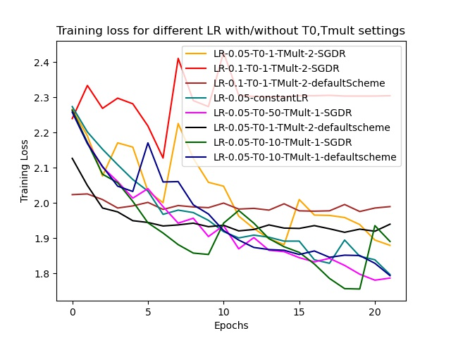 | 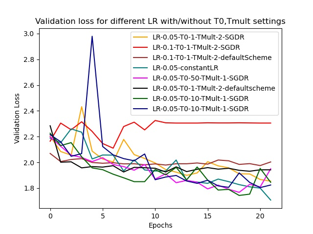

## Reference

VGG Architecture: https://pytorch.org/vision/stable/_modules/torchvision/models/vgg.html
