# Optimizers

## Code structure

All of our code can be found under the `notebooks` folder in our repository. 

## Commands to Reproduce Experiments

In order to run the notebooks we recommend the usage of Google Colab notebooks. 

## Task

The task that we are studying is using VGGNet to do image classfication. 

## Model Architecture

The model is is modelled after VGGNet and involves 4 convolutional layers and then a linear layer to allow for classifications.

## Datasets

We evaluate our approach on 3 publically avaliable datasets. 

#### CIFAR-10

This dataset contains 60k color images which are uniformly distributed accross 10 classes. The images are of size 4x32x32. 
- Alex Krizhevsky. [Learning Multiple Layers of Features from Tiny Images](https://www.cs.toronto.edu/~kriz/learning-features-2009-TR.pdf), 2009.

#### STL-10

This dataset contains 500 training images as well as one thousand testing images per class. Additionally, the dataset also contains 100k unlabeled images, which do not use for training, thus our model doesn't have state of the art performance.

- Adam Coates, Honglak Lee, Andrew Y. Ng. [An Analysis of Single Layer Networks in Unsupervised Feature Learning AISTATS](https://cs.stanford.edu/~acoates/papers/coatesleeng_aistats_2011.pdf), 2011

#### Caltech-101

This dataset consists of colour images of objects belonging to 101 classes. 
- Fei-Fei, Li, Rob Fergus, and Pietro Perona. "[One-shot learning of object categories.](http://vision.stanford.edu/documents/Fei-FeiFergusPerona2006.pdf)" IEEE transactions on pattern analysis and machine intelligence 28.4 (2006): 594-611.

## Experiments

The topics relating to optimizers address different concerns and the hyperparameters of each approach are vastly different. Therefore, we have experiments for each idea and then some comparisons at the end.

### Stocastic Gradient Descent

### Momentum (CM) and Nesterov's Accelerated Gradient (NAG)

To understand the importance of training with momentum we trained a VGG-11 style model with different momentum coefficients as well as testing Nesterov's Accelerated Gradient across 3 datasets. The code is located in notebooks/cm_and_nag.ipynb.

**Architecture**

In these experiments we used a VGG-11 architecture as shown below.
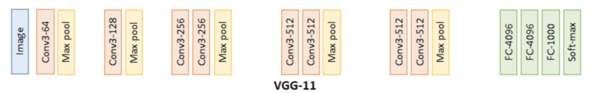
We trained for 20 epochs with a learning rate of 0.01, measuring validation loss and accuracy across each epoch.

**CIFAR-10**

Our baseline model without momentum had a performance of 1.3401 loss, 50.67% accuracy while our best performing model using CM reported 0.5305 loss, 83.06% accuracy and the best performing model using NAG reported 0.4804 loss, 84.33% accuracy.
CM | '
:-|-:
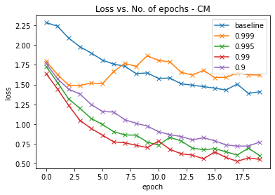 | 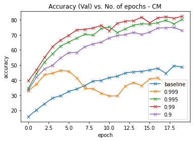

NAG | '
:-|-:
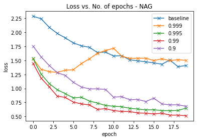 | 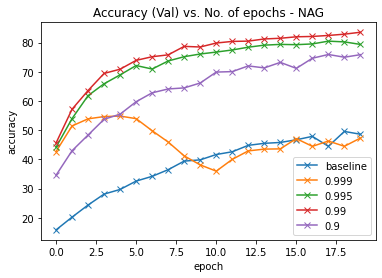

CM vs NAG | '
:-|-:
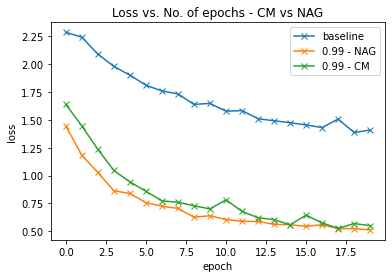 | 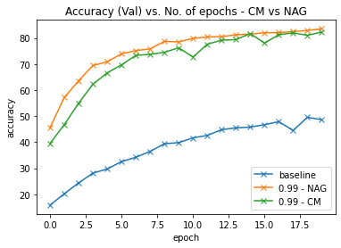

**STL10**

Our baseline model without momentum had a performance of 2.2834 loss, 13.25% accuracy while our best performing model using CM reported 1.8854 loss, 25.00% accuracy and the best performing model using NAG reported 1.7859 loss, 29.49% accuracy.
CM | '
:-|-:
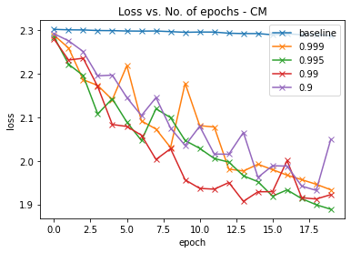 | 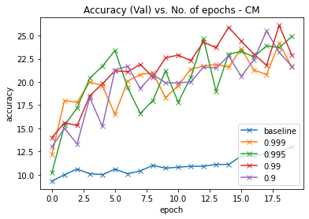

NAG | '
:-|-:
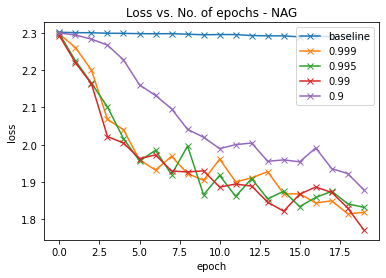 | 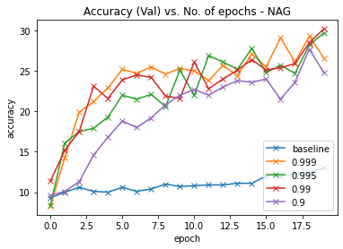

CM vs NAG | '
:-|-:
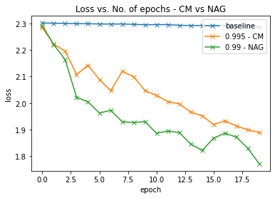 | 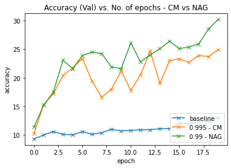

**Caltech101**

Our baseline model without momentum had a performance of 4.2107 loss, 12.44% accuracy while our best performing model using CM reported 3.8335 loss, 19.97% accuracy and the best performing model using NAG reported 3.6118 loss, 22.58% accuracy.
CM | '
:-|-:
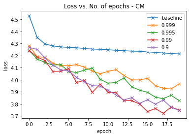 | 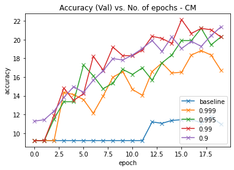

NAG | '
:-|-:
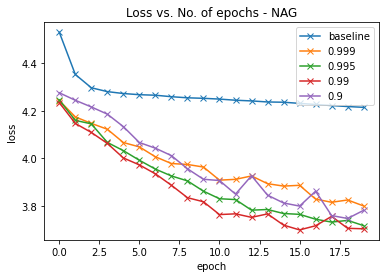 | 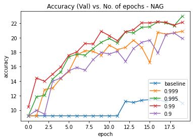

CM vs NAG | '
:-|-:
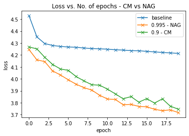 | 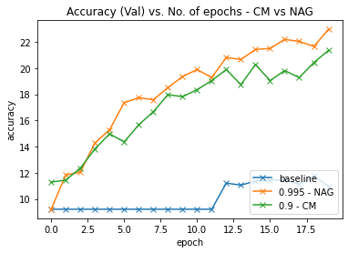

**Analysis**

Our testing shows that incorporating momentum has a significant impact on model performance. Both the CM and NAG implementations way outperform the baselines across all datasets. The paper found that loss decreases for higher momentum coefficients, however our results did not show the same relationship. Most datasets had different coefficient values perform best and even had different coefficients perform best when comparing CM to NAG. Despite this discrepancy, our experiments do align with the paper when comparing NAG to CM. NAG performs better with respect to loss and accuracy across all datasets. In general it looks like using NAG momentum seems to be the best momentum strategy to improve model performance.

### Cyclical Learning Rates

### Stocastic Gradient Descent with Warm Restarts

The summary can contain but is not limited to:

- Code structure.

- Commands to reproduce your experiments.

- Write-up of your findings and conclusions.

- Ipython notebooks can be organized in `notebooks`.

## Reference

VGG Architecture: https://pytorch.org/vision/stable/_modules/torchvision/models/vgg.html
